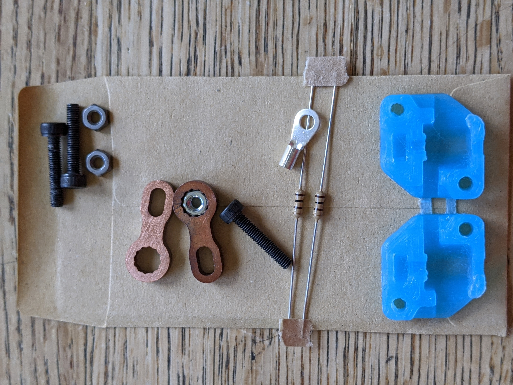

## Current and Voltage Rating

AB-90 switches are rated for use with XT-90 connectors and 10AWG wire.  We have tested stead-state currents up to 300 amps and the switch remains working until after the wire has de-soldered from the XT-90.  We have tested voltages up to 6s with the 100 ohm 1/4 watt anti-spark resistor, higher voltages may require a different value for this resitor (likely a 100 ohm, 1/2 watt resistor)

## Whats included

Switches come un-assembled, with the following:

* 1x open contactor
* 1x threaded contactor
* 1x housing
* 3x M3 20mm caphead screws
* 2x M3 nuts
* 1x piece of sand paper

## CAD Model

[Click to Download](./Simplified-90.STEP)

## Assembly Instructions

<iframe width="420" height="315" src="https://www.youtube.com/watch?v=kMkajTkXM5A" frameborder="0" allowfullscreen>
</iframe>