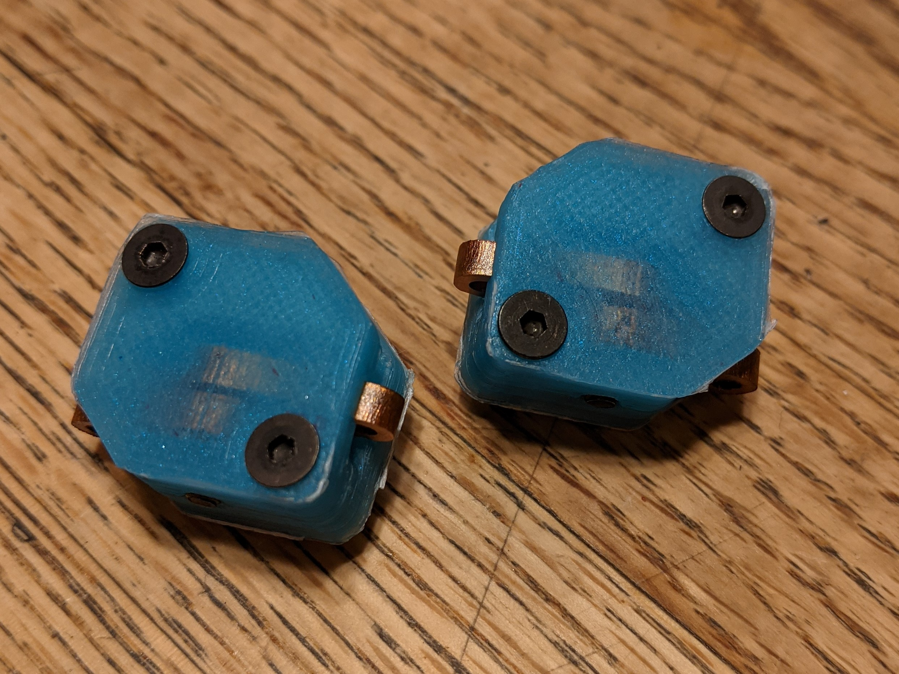

# Overview

Amp Boy is a line of switches for robotics apllications that are low cost, high current, and user serviceable.  They include optional anti-spark precharge circuits for higher voltage operation.  The design is biased so that the switch will fail "closed" rather than turning off when damaged or overheated.

### Current Rating

Rather than providing a current vs temperature table, Amp Boy switches are rated for use with certain battery connectors and wire guage.  The AB90 for example can be used with any batteries that use an XT90 connector (which typically comes with 10, 12, or 14 guage wire).  Testing and rating the switches this way simplifies component choice.